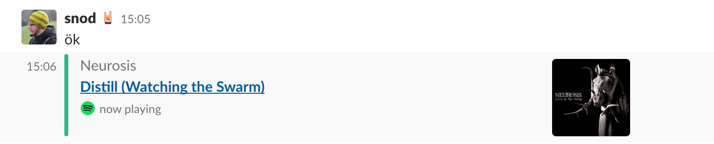

# slack-now-playing-spotify
A simple bash script to print the current track you're playing on spotify in a slack channel

# Requirements
- a mac running spotify
- curl

# Example

# Usage

1. place the script somewhere. It must be run on the mac running spotify
2. grab your personal auth token for your slack space: [Link](https://api.slack.com/custom-integrations/legacy-tokens)
3. adapt the configuration to your needs
  - change the token
  - change the channel
  - *optional* change the color
  - *bonus* set a footer icon url
4. execute the script, if nothing happens remove the `> /dev/null` redirect to see the error

I created an Alfred workflow to quickly execute the script.
